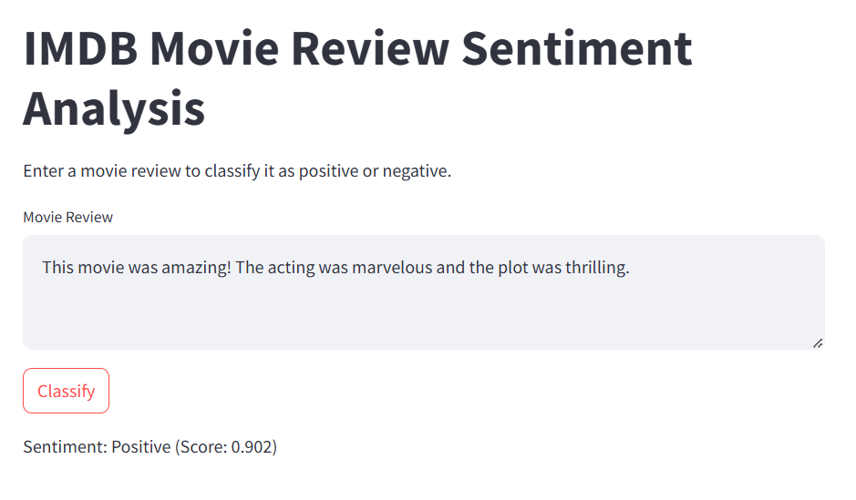
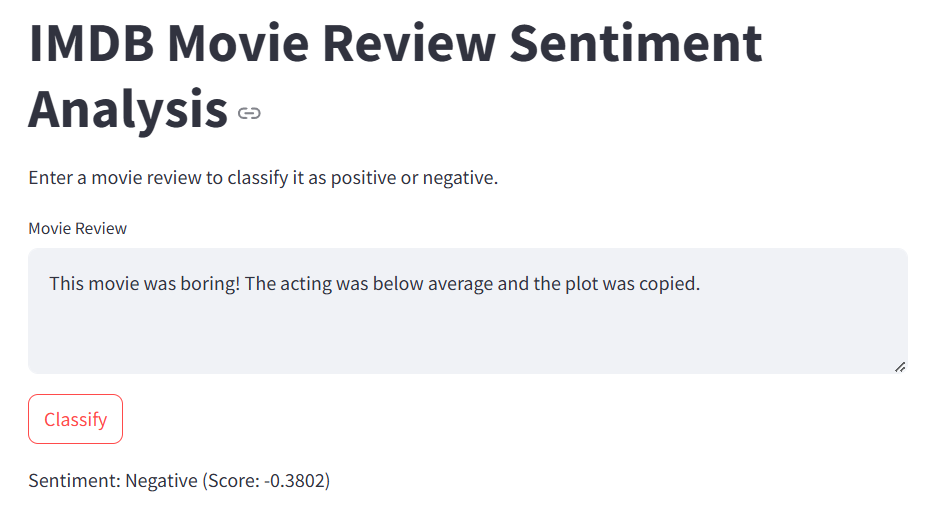

# IMDB Movie Review Sentiment Analysis

This project demonstrates a sentiment analysis application using Streamlit to classify IMDB movie reviews as positive or negative. The application integrates a pre-trained Recurrent Neural Network (RNN) model and VADER sentiment analysis to provide sentiment predictions. Users can interact with the application via a user-friendly web interface built using Streamlit.

## Project Structure

```
RNN
├── output
│   ├── 1.png                 # Sample output image 1
│   ├── 2.png                 # Sample output image 2
├── embedding.ipynb           # Jupyter notebook for exploring embeddings used in the RNN
├── main.py                   # Main script for running the Streamlit application
├── prediction.ipynb          # Jupyter notebook for testing and evaluating predictions
├── readme.md                 # Documentation for the project
├── requirements.txt          # List of dependencies for the project
├── simple_rnn_imdb.h5        # Pre-trained RNN model file
├── simplernn.ipynb           # Jupyter notebook for building and training the RNN model
```

## Installation and Setup

### Prerequisites

- Python 3.7 or higher
- pip (Python package manager)

### Steps to Set Up the Project

1. **Clone the Repository**:
   Clone the repository to your local machine using the following command:
   ```bash
   git clone <repository-url>
   cd RNN
   ```

2. **Install Dependencies**:
   Use the `requirements.txt` file to install all the required Python libraries:
   ```bash
   pip install -r requirements.txt
   ```

3. **Run the Application**:
   Start the Streamlit application using the command below:
   ```bash
   streamlit run main.py
   ```

4. **Access the Application**:
   Open your web browser and navigate to the URL displayed in the terminal (e.g., `http://localhost:8501`).

## Application Features

### User Input
- The application provides a text area for users to input a movie review.
- Users can enter any review text for sentiment analysis.

### Sentiment Analysis
- **RNN Model**: A pre-trained RNN model (`simple_rnn_imdb.h5`) is used to analyze the sentiment of IMDB movie reviews. The model classifies the review as either positive or negative.
- **VADER Sentiment Analysis**: VADER (Valence Aware Dictionary and sEntiment Reasoner) is used for an additional layer of sentiment analysis. It provides a compound score to determine the sentiment polarity.

### Results Display
- The application displays the sentiment classification (Positive/Negative) along with the compound sentiment score generated by VADER.
- Provides a clear and concise output for user interpretation.

## Detailed Code Walkthrough

### 1. **Loading Libraries and Model**
- Key libraries such as TensorFlow, Streamlit, and VADER are imported.
- The IMDB dataset's word index is loaded to preprocess user input.
- A pre-trained RNN model (`simple_rnn_imdb.h5`) is loaded to classify sentiments.

### 2. **Helper Functions**
- `decode_review`: Decodes encoded reviews back into human-readable text for debugging and understanding.
- `preprocess_text`: Converts user input into a format suitable for the RNN model by tokenizing and padding the input text.

### 3. **Streamlit Interface**
- **Title and Description**: The app displays a title and brief instructions for the user.
- **Text Area Input**: A text area is provided for users to input their movie reviews.
- **Classification Button**: Users can click the "Classify" button to analyze the sentiment of their review.
- **Result Display**: The app shows the sentiment classification result and VADER's sentiment score.

## Requirements

The required libraries and dependencies are listed in the `requirements.txt` file. Key dependencies include:

- TensorFlow: For loading and using the pre-trained RNN model.
- Streamlit: To create the web application interface.
- VADER Sentiment Analysis: For an additional sentiment analysis layer.
- NumPy: For numerical operations.

To install all dependencies, run:
```bash
pip install -r requirements.txt
```

## Usage

1. **Launch the Application**:
   Run the Streamlit app using the following command:
   ```bash
   streamlit run main.py
   ```

2. **Input a Review**:
   Enter a movie review in the text area provided on the web interface.

3. **Classify Sentiment**:
   Click the "Classify" button to analyze the sentiment of the input review.

4. **View Results**:
   The application will display whether the review is classified as "Positive" or "Negative," along with the sentiment score from VADER.

## Screenshots

### Sample Output 1


### Sample Output 2


## Model Details

The RNN model (`simple_rnn_imdb.h5`) was trained on the IMDB dataset for binary sentiment classification (positive/negative). It uses an embedding layer and a simple recurrent layer with ReLU activation for robust sentiment prediction.

### VADER Sentiment Analysis

VADER is a rule-based sentiment analysis tool that provides polarity scores (positive, neutral, negative, and compound). It complements the RNN model by offering an additional perspective on the sentiment of the review.

## Future Improvements

- **Model Enhancement**: Train a more complex model with additional layers or fine-tune using recent datasets.
- **Multi-Class Sentiment**: Extend the model to classify reviews into multiple sentiment categories (e.g., very positive, neutral, very negative).
- **UI Improvements**: Enhance the Streamlit interface for better user experience.
- **Visualization**: Add visualizations to represent sentiment scores and trends.

## Acknowledgments

- The IMDB dataset for movie reviews.
- TensorFlow for enabling the creation and deployment of machine learning models.
- VADER for its simple yet effective sentiment analysis capabilities.
- Streamlit for providing a platform to build interactive web applications.

---
Feel free to contribute to this project by submitting issues or pull requests!